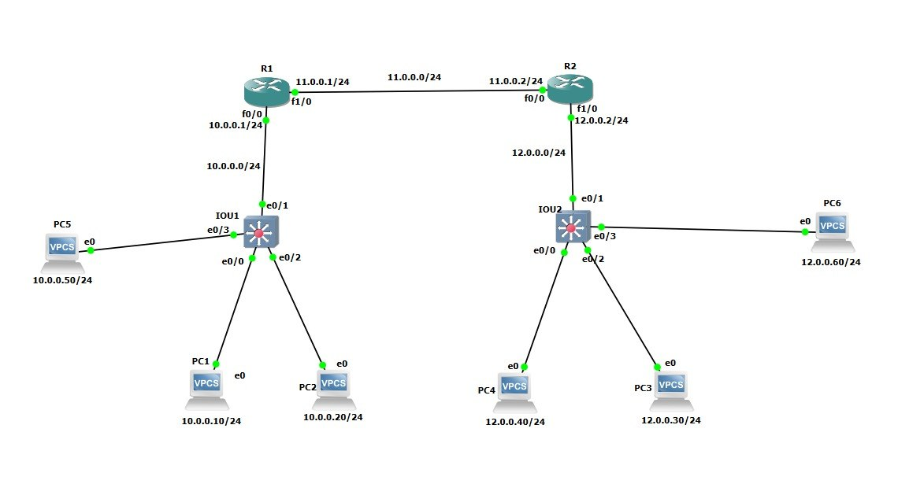

# OSPF-MultiArea-GNS3-Lab

An enterprise-level network design simulating a multi-area OSPF routing environment using GNS3. This repository contains topology images, running configurations, and full end-to-end connectivity verification.

---

## 🗺️ Network Topology

Here is the structured network layout designed for this lab:

### IP Addressing & Area Strategy:
* **Area 0 (Backbone):** Connects the core routers via network `11.0.0.0/24`.
* **Area 1 (Custom Loopback Area):** Used on R1 (`1.1.1.0/24`) to practice Inter-Area (`O IA`) propagation.
* **Area 10 (Branch 1):** Services the user network `10.0.0.0/24` (PCs: 1, 2, 5).
* **Area 12 (Branch 2):** Services the user network `12.0.0.0/24` (PCs: 3, 4, 6).

---

## 🛠️ Tech Stack & Virtualization
* **Emulator:** GNS3
* **Switching:** Cisco IOU L2 Images
* **Routing:** Cisco IOS Routers
* **End Devices:** VPCS (Virtual PCs)

---

## 📉 Verification & Routing Tables

Full network convergence was verified from the routing tables. Inter-Area routes are correctly designated with the **`O IA`** flag, signaling successful multi-area updates between the areas.

### Verification Metadata & Connectivity:
* **Routing Table Analysis:** Both routers correctly exchange topology summaries, displaying remote networks with the proper OSPF metrics.
* **End-to-End Connectivity:** Ping tests were successfully executed between all cross-area hosts (from Area 10 hosts directly to Area 12 hosts) with a 100% success rate.

---

## 📁 Repository Structure
* `/device-configs`: Contains final running configurations for `R1` and `R2`.
* `ping_verification.png` & `ping_verification 2.png`: Connectivity check screenshots.
* `R1-configuration.png` & `R2-configuration.png`: Routing state verification captures.
